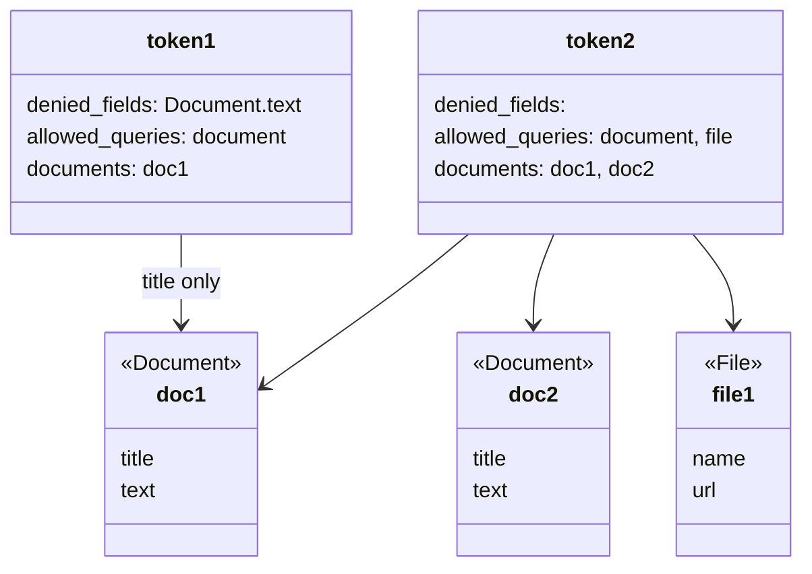

# Lambda authorizer for AppSync

This repository is a demonstration on how to use a Lambda function as an authorization for an AppSync API.

Here, the schema has *Documents* and *Files* and users need a *Token* to make requests to the API. For each of these tokens, we can:

* Deny fields (```token1``` can not read the documents' text)
* Allow only certain queries (```token1``` can not read any files)
* Restrict access to documents by id (```token1``` can only read ```doc1``` but not ```doc2```)



## Prerequisites

* AWS account
* Terraform installed and configured for AWS

## Install

* ```terraform init```
* ```terraform apply```

## Use

* Go to the AppSync console, select the *Queries* tab
* Fetch ```doc1``` using ```token1```:

```graphql
query MyQuery {
  document(id: "doc1") {
    id
    title
  }
}
```


### Denied fields

* Try to fetch the document ```text```:

```graphql
query MyQuery {
  document(id: "doc1") {
    id
    title
    text
  }
}
```

**Unauthorized**

But with ```token2``` it works:

```json
{
  "data": {
    "document": {
      "id": "doc1",
      "title": "Document 1",
      "text": "Text for document 1"
    }
  }
}
```

### No access to the ```file``` query

* Try to fetch a *file*:

```graphql
query MyQuery {
  file(id: "file1") {
    id
    name
    url
  }
}
```

* ```token1``` => **Unauthrized**
* ```token2``` => works

### Document-level access control

* Try to access ```doc2```:

```graphql
query MyQuery {
  document(id: "doc2") {
    id
    title
  }
}
```

* ```token1``` => **Unauthrized**
* ```token2``` => works

## Cleanup

* ```terraform destroy```
