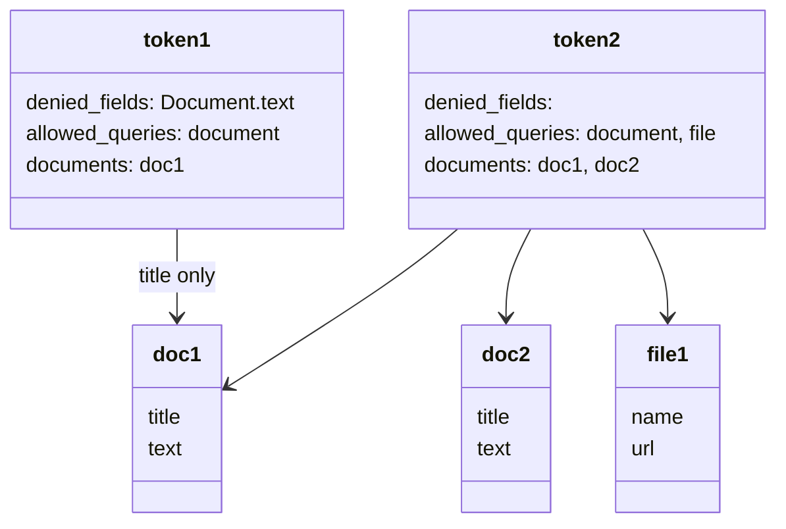

# appsync-lambda-auth

```mermaid
classDiagram
    class token1 {
        denied_fields: Document.text
        allowed_queries: document
        documents: doc1
    }
    class token2 {
        denied_fields: 
        allowed_queries: document, file
        documents: doc1, doc2
    }
    class doc1 {
        title
        text
    }
    class doc2 {
        title
        text
    }
    class file1 {
        name
        url
    }
    token1 --> doc1: title only
    token2 --> doc1
    token2 --> doc2
    token2 --> file1
```
